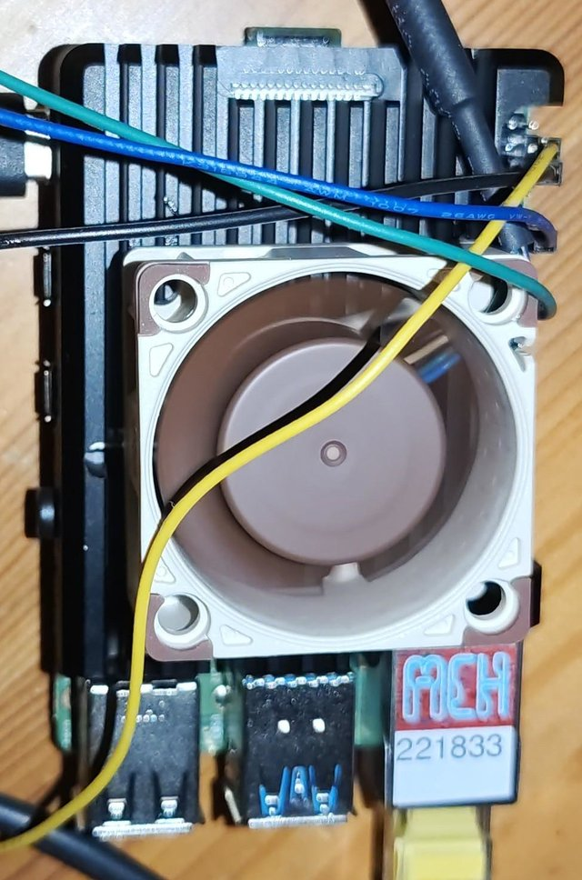

# noctua-fan

<p align="center">
  <a href="https://www.raspberrypi.com/products/raspberry-pi-4-model-b/">
    
  </a>
  <a href="https://noctua.at/en/nf-a4x20-5v-pwm">
    
  </a>
  
  
  
  <a href="./LICENSE">
    
  </a>
  <a href="https://www.paypal.me/RenaudAllard">
    
  </a>
</p>

---

Temperature-driven speed control for a Noctua NF-A4x20 5V PWM fan on a
Raspberry Pi 4, using the SoC's hardware PWM. One file, no daemon framework,
no pip packages, four selectable fan curves.

Developed and measured on a Raspberry Pi 4 Model B Rev 1.5 with the fan
mounted on a Geekworm P122 cooler, running at `arm_freq=2100`. Every
temperature quoted below is a property of that particular combination of
heatsink, clock speed, enclosure and room, not of the fan on its own. Treat
the numbers as a worked example and measure your own.

| | |
| --- | --- |
| **Fan** | Noctua NF-A4x20 5V PWM |
| **Host** | Raspberry Pi 4 Model B |
| **Control signal** | Hardware PWM0 on GPIO18, 25 kHz |
| **Feedback** | Tachometer on GPIO24, 2 pulses per revolution |
| **Default curve** | `moderate` |
| **Dependencies** | `python3-gpiozero`, `python3-lgpio` |
| **Status file** | `/run/noctua-fan/status` |
| **License** | [BSD 2-Clause](LICENSE) |

---

## Table of Contents

- [Why hardware PWM](#why-hardware-pwm)
- [Wiring](#wiring)
- [Boot configuration](#boot-configuration)
- [Install](#install)
- [Fan curves](#fan-curves)
- [Choosing a mode](#choosing-a-mode)
- [What the fan actually buys](#what-the-fan-actually-buys)
- [Status output](#status-output)
- [tmux](#tmux)
- [Verify](#verify)
- [Setting the speed by hand](#setting-the-speed-by-hand)
- [Files](#files)
- [License](#license)

---

## Why hardware PWM

The fan expects a 25 kHz control signal; 21-28 kHz is supported and outside
that range it behaves unpredictably. That rules out the two obvious shortcuts:

- **`dtoverlay=pwm-gpio-fan`** sets a 20 ms period, which is 50 Hz. It is meant
  for simple on/off fans, not a Noctua.
- **`RPi.GPIO` software PWM** tops out far below 25 kHz and jitters under load.

So the blue wire goes to a pin backed by the PWM peripheral, driven through
the kernel's PWM sysfs interface.

No pip packages: the script writes to PWM sysfs directly, which also avoids
Bookworm's `externally-managed-environment` refusal.

---

## Wiring

| Fan wire | Function | Pi 4 physical pin | BCM |
| -------- | -------- | ----------------- | --- |
| Yellow   | +5 V     | 4                 | -   |
| Black    | GND      | 6                 | -   |
| Blue     | PWM in   | 12                | 18  |
| Green    | Tach out | 18                | 24  |

<p align="center">
  
</p>

On this fan yellow is +5 V power, not a signal. Current draw is 0.1 A max.

No level shifter is needed on the blue wire: Noctua fans read both 3.3 V and
5 V as logical high. The green wire is an open-collector output and needs a
pull-up; the script enables the pin's internal one. Do not pull it up to 5 V,
Pi 4 GPIOs are 3.3 V logic and are not 5 V tolerant.

The fan's 4-pin Molex plug does not mate with the header. Use female-to-male
jumpers, or cut into the supplied NA-EC1 extension rather than the fan lead.

---

## Boot configuration

Append to the end of `/boot/firmware/config.txt` (`/boot/config.txt` before
Bookworm):

```
[all]
# Noctua NF-A4x20 5V PWM on GPIO18 (physical pin 12)
dtoverlay=pwm-2chan
```

Two things the `[all]` line and the placement guard against:

- A `dtparam=` after a `dtoverlay=` binds to that overlay rather than to the
  base device tree, so the overlay must come after every `dtparam` line.
- The stock file often ends in a model filter such as `[cm4]`. Anything
  appended below it would never load on a Pi 4 B. `[all]` resets the filter.

`dtoverlay=vc4-kms-v3d` does not conflict: it claims no GPIO. The 3.5 mm
analogue jack does share the PWM channels, so that output is lost. HDMI and
USB audio are unaffected.

If the stock `#dtoverlay=gpio-ir-tx,gpio_pin=18` line has been uncommented at
some point, it collides with GPIO18 directly.

---

## Install

```sh
sudo apt install -y python3-gpiozero python3-lgpio

sudo install -m 755 noctua-fan.py /usr/local/bin/noctua-fan.py
sudo install -m 644 noctua-fan.service /etc/systemd/system/noctua-fan.service

sudo systemctl daemon-reload
sudo systemctl enable noctua-fan.service
sudo reboot
```

To run a curve other than the built-in default, drop the mode into
`/etc/default/noctua-fan`:

```sh
printf 'NOCTUA_FAN_ARGS="--mode quiet"\n' | sudo tee /etc/default/noctua-fan
sudo systemctl restart noctua-fan.service
```

The unit reads that file through `EnvironmentFile=-/etc/default/noctua-fan`.
The leading `-` makes it optional, and an unset `$NOCTUA_FAN_ARGS` expands to
zero arguments rather than an empty one, so with no file at all the service
starts on the default curve.

Confirm which curve is live:

```sh
journalctl -u noctua-fan.service | grep '^mode'
```

---

## Fan curves

Four curves ship in the `MODES` table at the top of `noctua-fan.py`. Pick one
with `-m` / `--mode`; `noctua-fan.py --help` prints the same table, rendered
from `MODES` so it cannot drift from the code.

Every curve moves in 10% steps of duty, 1.5 C apart. The table reads as the
temperature at which each mode first asks for a given speed, so find your own
idle temperature in the rpm column's neighbourhood and read across.

| Duty | rpm | `quiet` | `moderate` | `aggressive` | `maximum` |
| ---- | ---- | ------- | ---------- | ------------ | --------- |
| off | 0 | <=30 C | <=30 C | <=29 C | <=28 C |
| 20% | 1140 | 33 C | - | - | - |
| 30% | 1818 | 34.5 C | - | - | - |
| 40% | 2418 | 36 C | 33 C | - | - |
| 50% | 2976 | 37.5 C | 34.5 C | - | - |
| 60% | 3504 | 39 C | 36 C | 32 C | - |
| 70% | 3978 | 40.5 C | 37.5 C | 33.5 C | - |
| 80% | 4422 | 42 C | 39 C | 35 C | - |
| 90% | 4812 | 43.5 C | 40.5 C | 36.5 C | - |
| 100% | 5208 | 45 C | 42 C | 38 C | 31 C |

`moderate` is the default. The rpm column was measured on this fan with the
tachometer, holding each duty in turn; expect your own to differ.

Four rules hold across every curve, and a new one should keep them:

- **Nothing lands between 0 and 20% duty.** Above 20% this fan is linear in
  duty, near enough 50 rpm per percent. Below it the fan leaves that line
  entirely: 10% duty turns at about 410 rpm where the fit predicts 840. It does
  still start and run steadily there on this unit, but Noctua specifies nothing
  below 20%, so no curve relies on it.
- **Steps are 10% of duty and 1.5 C apart.** One step is worth about 500 rpm,
  which is a change you can hear as a new speed rather than as a jump.
- **The off point sits 3 C below the first step.** That dead band is what stops
  the fan cycling on and off at idle.
- **`HYSTERESIS_C` applies on cooldown only.** Rising temperature steps the
  speed up at once; falling temperature has to drop 2 C below a threshold
  before the speed steps back down. At 2 C it is wider than the 1.5 C between
  steps, so a cooling CPU gives up more than one step at a time. `target_duty()`
  only ever uses it to lower the duty, and it holds a separate guard at the
  mode's off point, so widening it can never quietly keep the fan spinning
  below that point.

`maximum` keeps a single step on purpose: it means full speed whenever the fan
turns at all, and subdividing it would make it something other than maximum.

To run at a fixed speed with no thermal control, add a mode whose curve is a
single entry such as `[(0, 40)]`.

---

## Choosing a mode

The choice only ever changes behaviour in the idle band. Replaying all four
curves against the measured duty-to-temperature map below shows every one of
them settling at 100% under sustained full load, reached in a single step from
a stopped fan. Under load the curves are indistinguishable, so pick on how loud
you want the machine at rest.

Read the curve table above against your own idle temperature, which is the
figure that decides how the machine sounds nearly all the time. Note that these
thresholds are far below where a Pi 4 needs help: the Arm cores throttle
progressively between 80 C and 85 C, and there is no soft limit below that.
Every curve here trades noise for headroom rather than protecting the SoC.

---

## What the fan actually buys

Measured with `stress-ng --cpu 4` running unchanged across the whole sweep,
descending through the duty steps with 150 seconds to settle and a 60 second
average at each. The CPU held 2100 MHz at every point, so the heat input was
identical throughout and nothing was thermally capped.

The heatsink is a Geekworm P122 and the board is clocked at `arm_freq=2100`,
so these figures describe that pairing. A different cooler moves every row.

| Duty | rpm  | Temp   | vs fan off | Step gain | C per 1000 rpm |
| ---- | ---- | ------ | ---------- | --------- | -------------- |
| 0%   |    0 | 63.8 C |            |           |                |
| 20%  | 1042 | 56.2 C | -7.6       | -7.6      | 7.30           |
| 40%  | 2249 | 53.0 C | -10.8      | -3.2      | 2.65           |
| 60%  | 3372 | 50.8 C | -13.0      | -2.2      | 1.98           |
| 80%  | 4390 | 49.1 C | -14.7      | -1.7      | 1.64           |
| 100% | 5290 | 48.2 C | -15.6      | -0.9      | 1.02           |

The rpm column is measured on one fan with the tachometer, not interpolated
from the datasheet. Noctua's anchors are 1100 rpm at 20% and 5000 rpm at 100%,
so this unit runs slightly faster than spec at the top of its range. Expect
your own to differ and measure it rather than copying these numbers.

Three things follow.

**The entire range available to any control law is 8 C.** Going from minimum
spin to maximum, 1042 to 5290 rpm and 408% more air, moves the CPU 8 C. Cooling
efficiency falls sevenfold across the sweep: the first 1042 rpm is worth 7.6 C,
the last 1919 rpm is worth 2.6 C. Nothing clever in the control loop can beat
holding 100%, and holding 100% is only 8 C better than idling the fan at its
floor.

**The top of the curve is close to free to give up.** 60% duty already captures
13.0 of the 15.6 C on offer, and the step from 80% to 100% buys 0.9 C in
exchange for the loudest state the fan has. Capping a curve below 100% costs
very little and is noticeably quieter.

**The fan is a comfort device here rather than a protective one.** With it
stopped completely, sustained full load settled at 63.8 C, still well clear of
the 80 C throttle point, and `vcgencmd get_throttled` read 0x0 both before and
after. Ambient temperature and the enclosure will move that figure, so repeat
the sweep rather than assuming it.

To repeat it: stop the service, drive the duty by hand as shown under
[Setting the speed by hand](#setting-the-speed-by-hand), hold a constant load,
and average `/sys/class/thermal/thermal_zone0/temp` over a minute once the
reading has stopped drifting. Watch the temperature while the fan is stopped
and give yourself an abort threshold below 80 C, where the firmware starts
throttling and the load stops being constant.

A caveat on the 150 second settle: at low duty there is far less airflow, the
thermal time constant is correspondingly longer, and the 0% and 20% rows are
the ones most likely to have been read before they were fully settled. The
sweep ran descending, so every step heats toward a higher equilibrium and an
unsettled reading is below the true value, never above.

### Why the steps are 10% and stop at 20%

Holding each duty in turn and reading the tachometer gives a straight line from
20% upwards: `rpm = 50.4 x duty + 338`, with an R2 of 0.9916 over the nine
points from 20 to 100%. A 10% step is therefore worth about 504 rpm anywhere in
that range, which is why the curves can afford steps that fine and why each one
is audible as a distinct speed rather than as a jump.

Below 20% the line stops describing the fan. At 10% duty it settles at 408 rpm
where the fit predicts 842, roughly half the speed the trend calls for. It runs
steadily there rather than erratically, and on this unit it does start from a
standstill, but it is outside the range Noctua specifies and another fan need
not behave the same way. That is the reason no curve puts a step between 0
and 20%.

Started from a full stop rather than coasted down to, the low duties measure
426 rpm at 10%, 762 rpm at 15%, 1092 rpm at 20% and 1397 rpm at 25%. The fan
started every time, so 20% is a specification floor here rather than an observed
failure.

These rpm figures come from a shorter run than the thermal sweep above, five
seconds per point rather than a sixty second average, and at idle rather than
under load. They sit within about 8% of the sweep's numbers, which is what the
shorter window and the lighter load account for. Where a single coherent set of
duty, rpm and temperature matters, use the sweep table.

---

## Status output

Every interval the script writes one line to `/run/noctua-fan/status`, on
tmpfs, replaced atomically so a reader never sees a partial line:

```
2450rpm 41C
off 28C
```

`RuntimeDirectory=noctua-fan` in the unit creates `/run/noctua-fan` at start
with mode 0755, so an unprivileged reader needs no udev rule. The same
setting removes the directory when the service stops, so a missing file means
a stopped service. Add `RuntimeDirectoryPreserve=restart` if the last reading
should survive a restart.

Set `STATUS_FILE = None` to turn the feature off.

The journal carries a fuller line, plus the active mode at startup:

```
mode moderate: off <=30C  33C:40% 36C:60% 39C:80% 42C:100%
37.5C  duty= 60%   3254 rpm
```

---

## tmux

`tmux-status.conf` holds the status-bar lines; append them to `~/.tmux.conf`
or source the file from it, then `tmux source-file ~/.tmux.conf`.

```tmux
set -g status-interval 2
set -g status-right-length 60
set -g status-right "#(uname -n) #(cat /run/noctua-fan/status 2>/dev/null || echo n/a)"
```

`status-right-length` has to be raised: it defaults to 40 and tmux truncates
past it silently. `status-interval 2` matches the script's own interval;
the default of 15 would leave the reading stale. Below 1 second is pointless,
tmux will not run a `#()` command more than once a second.

The published line carries no percent sign on purpose. tmux expands status
templates through `strftime`, and whether that expansion also covers the
output of a `#()` job is untested here. To find out:

```sh
sudo sh -c 'echo "test 60% ok" > /run/noctua-fan/status'
```

If the status bar shows it intact, the duty cycle can be added to the
published line. The service overwrites the file on its next tick either way.

---

## Verify

```sh
raspi-gpio get 18                        # expect func=PWM0
ls /sys/class/pwm                        # expect pwmchip0
lsmod | grep pwm                         # expect pwm_bcm2835
dmesg | grep -i -e pwm -e "already requested"
systemctl status noctua-fan.service
journalctl -u noctua-fan.service -f
cat /run/noctua-fan/status
```

If `raspi-gpio get 18` still reports `OUTPUT`, another overlay has claimed
the pin. The failure looks like
`pinctrl-bcm2835 fe20a000.gpio: pin GPIO18 already requested by fe215080.spi`.

Two behaviours that are correct rather than faults: the fan runs at full
speed from power-on until the service takes over, and it returns to full
speed when the service stops, which is the deliberate fail-safe in `bail()`.

Force a full-speed transition to test the top of the curve:

```sh
sudo apt install -y stress-ng
stress-ng --cpu 4 --timeout 180s
```

---

## Setting the speed by hand

Stop the service first or the two fight over the same file.

```sh
sudo systemctl stop noctua-fan.service

C=/sys/class/pwm/pwmchip0
sudo sh -c "echo 0 > $C/export"           # skip if pwm0/ exists
sudo sh -c "echo 0 > $C/pwm0/duty_cycle"  # zero before shrinking the period
sudo sh -c "echo 40000 > $C/pwm0/period"  # 40 us == 25 kHz
sudo sh -c "echo 1 > $C/pwm0/enable"
sudo sh -c "echo 20000 > $C/pwm0/duty_cycle"   # 50%
```

`duty_cycle` may never exceed `period`, which is why the order matters.

---

## Files

| File                 | Installed as                             | Purpose                          |
| -------------------- | ---------------------------------------- | -------------------------------- |
| `noctua-fan.py`      | `/usr/local/bin/noctua-fan.py`           | the controller                   |
| `noctua-fan.service` | `/etc/systemd/system/noctua-fan.service` | unit, reads the file below       |
| -                    | `/etc/default/noctua-fan`                | optional, sets `NOCTUA_FAN_ARGS` |
| `tmux-status.conf`   | appended to `~/.tmux.conf`               | status-bar lines                 |

---

## License

BSD 2-Clause. Copyright (c) 2026, Renaud Allard <renaud@allard.it>.
See [LICENSE](LICENSE).
